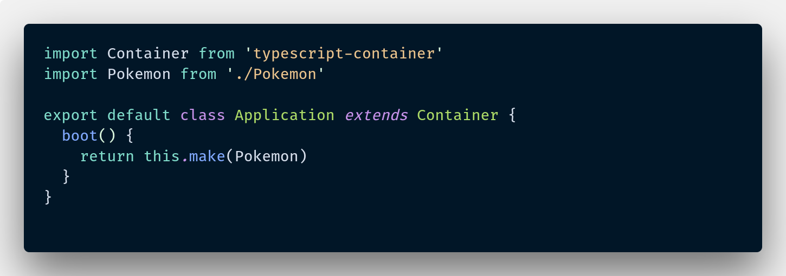
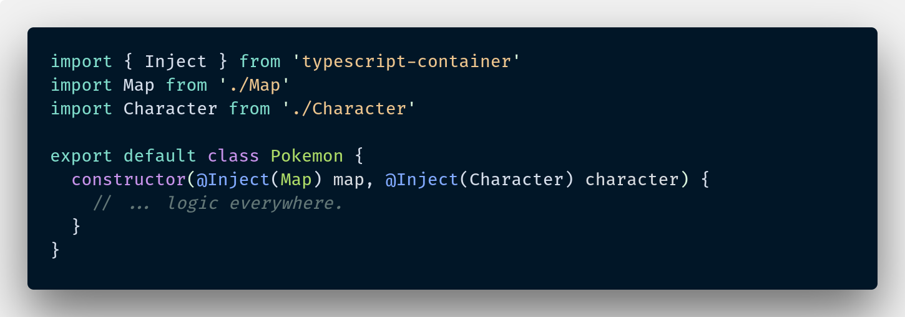
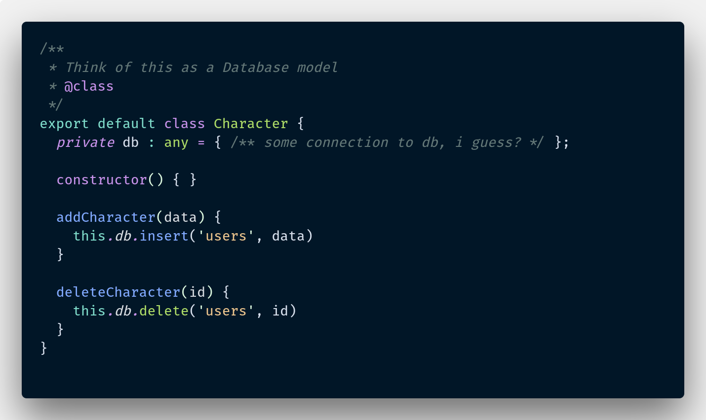
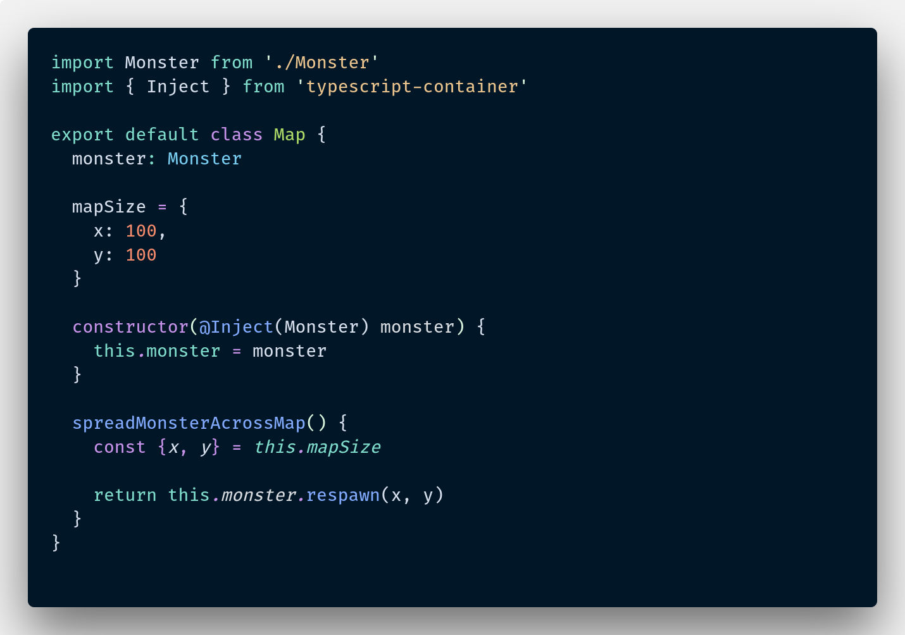
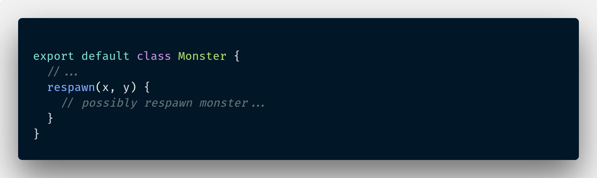

# Typescript Container (IOC)
> Kinda port of Laravel's illuminate/container to typescript.

[![Build Status][travis-image]][travis-url]
[![NPM Version][npm-image]][npm-url]
[![Downloads Stats][npm-downloads]][npm-url] 

Nub Inversion of Control container highly based on illuminate/container from Laravel. You can think of it as a port of illuminate/container to typescript, however, there's no guarantee that everything would work as it should. This module was designed for typescript and thus I cannot guarantee compatibility with ES6 alone.

## Installation

```sh
npm i --save typescript-container
```

## Known issues / Not working

* ~~Contextual Bindings doesn't work just yet.~~
* ~~Storing arbitrary values~~
* Every other stuffs aside from basic functionality.
* Primitive types as dependency
* tagging
* overriding constructor parameters
* callback supports

## Basic Usage  

You can start by requiring the ioc container then do your thing.

src/index.ts:

src/Pokemon.ts:

src/Character.ts:

src/Map.ts:

src/Monster.ts:


injecting dependencies to any other method (other than constructor) also works.


## Release History
* 0.0.3
  * added factory() and singleton()
* 0.0.2
  * basic contextual binding added
* 0.0.1
  * basic functionality

## Meta

Jacob Baring – [@yakovmeister](https://twitter.com/yakovmeister) – so@tfwno.gf

Distributed under the MIT license. See ``LICENSE`` for more information.

[https://github.com/yakovmeister/](https://github.com/yakovmeister/)

## Contributing

1. Fork it (<https://github.com/yakovmeister/typescript-container/fork>)
2. Create your feature branch (`git checkout -b feature/fooBar`)
3. Commit your changes (`git commit -am 'Add some fooBar'`)
4. Push to the branch (`git push origin feature/fooBar`)
5. Create a new Pull Request

<!-- Markdown link & img dfn's -->
[npm-image]: https://img.shields.io/npm/v/typescript-container.svg?style=flat-square
[npm-url]: https://npmjs.org/package/typescript-container
[npm-downloads]: https://img.shields.io/npm/dm/typescript-container.svg?style=flat-square
[travis-image]: https://travis-ci.org/yakovmeister/typescript-container.svg?branch=dev
[travis-url]: https://travis-ci.org/yakovmeister/typescript-container
[wiki]: https://github.com/yourname/yourproject/wiki